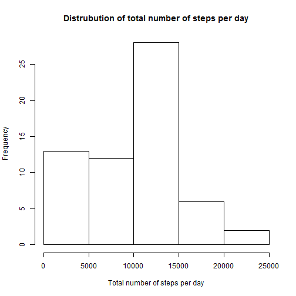
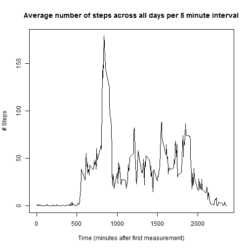
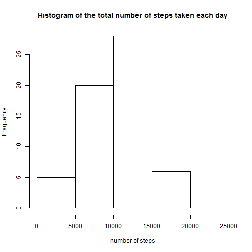
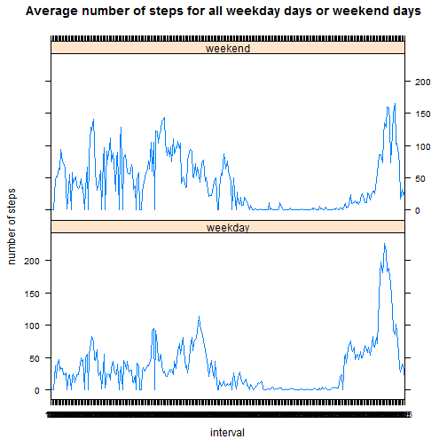

---
output:
  html_document:
    keep_md: yes
---
# Reproducible Research: Peer Assessment 1


## A. Loading and preprocessing the data

#### Read data 

```r
activity <- read.csv("activity.csv")
```
#### Explore data format

```r
str(activity)
```

```
## 'data.frame':	17568 obs. of  3 variables:
##  $ steps   : int  NA NA NA NA NA NA NA NA NA NA ...
##  $ date    : Factor w/ 61 levels "2012-10-01","2012-10-02",..: 1 1 1 1 1 1 1 1 1 1 ...
##  $ interval: int  0 5 10 15 20 25 30 35 40 45 ...
```
#### Transform date from Factor to Date

```r
activity$date <- as.Date(activity$date, "%Y-%m-%d")
```


## B. What is mean total number of steps taken per day?

#### Histogram  of the total number of steps taken each day

```r
hist(tapply (activity$steps,activity$date,sum, na.rm=TRUE), main="Distrubution of total number of steps per day", xlab="Total number of steps per day")
```

 

#### Mean  total number of steps taken per day

```r
mean(tapply(activity$steps,activity$date,sum, na.rm=TRUE), na.rm=TRUE)
```

```
## [1] 9354
```
#### Median  total number of steps taken per day

```r
median(tapply(activity$steps,activity$date,sum, na.rm=TRUE), na.rm=TRUE)
```

```
## [1] 10395
```

## C. What is the average daily activity pattern?

#### Make a time series plot (i.e. type = "l") of the 5-minute interval (x-axis) and the average number of steps taken, averaged across all days (y-axis)

```r
activity$interval <- as.factor(activity$interval)

average_number_of_steps_per_interval <- tapply(activity$steps, activity$interval, sum, na.rm = TRUE)/length(levels(as.factor(activity$date)))

plot(x = levels(activity$interval), y = average_number_of_steps_per_interval, type = "l", xlab = "Time (minutes after first measurement)", ylab = "# Steps", main = "Average number of steps across all days per 5 minute interval")
```

 

#### Which 5-minute interval, on average across all the days in the dataset, contains the maximum number of steps?

```r
names(which.max(average_number_of_steps_per_interval))
```

```
## [1] "835"
```
## D. Imputing missing values

#### Calculate and report the total number of missing values in the dataset (i.e. the total number of rows with NAs)

```r
number_of_missing <- sum(!complete.cases(activity$steps))
```
Number of missing values  is 2304.

#### Devise a strategy for filling in all of the missing values in the dataset. The strategy does not need to be sophisticated. 

Use the mean/median of that 5-minute interval to fill in all of the missing values in the dataset. The original dataset with the missing data is stored in original_data and the clean dataset with the missing data filled in is stored in clean_data.


#### Create a new dataset that is equal to the original dataset but with the missing data filled in.


```r
original_data <- activity
for (i in 1:length(activity$steps)) {
    if (is.na(activity$steps[i])) {
        for (j in 1:length(average_number_of_steps_per_interval)) {
            if (as.character(activity$interval[i]) == names(average_number_of_steps_per_interval[j])) 
                activity$steps[i] = average_number_of_steps_per_interval[j]
        }
    }
}
clean_data <- activity
```


#### Make a histogram of the total number of steps taken each day and Calculate and report the mean and median total number of steps taken per day.


```r
sum_clean_steps <- tapply(clean_data$steps, clean_data$date, sum, na.rm = TRUE, 
    simplify = TRUE)
hist(sum_clean_steps, xlab = "number of steps", main = "Histogram of the total number of steps taken each day")
```

 


```r
mean_steps = mean(sum_clean_steps)
```


```r
median_steps = median(sum_clean_steps)
```


####Do these values differ from the estimates from the first part of the assignment? What is the impact of imputing missing data on the estimates of the total daily number of steps?
The mean and median total number of steps taken per day are 1.0581 &times; 10<sup>4</sup> and 1.0395 &times; 10<sup>4</sup>. Compared with the estimates from the first part of the assignment, the difference of mean and median value are -1226.7842 and 0. The shape of the two histograms change a little for the number smaller than 10000. There is no difference in the median values. But the mean value increased significantly. 

## E. Are there differences in activity patterns between weekdays and weekends?


#### Create a new factor variable in the dataset with two levels - "weekday" and "weekend" indicating whether a given date is a weekday or weekend day.


```r
weekday <- weekdays(as.Date(clean_data$date, "%Y-%m-%d"))
for (i in 1:length(weekday)) {
    if ((weekday[i] == "Saturday") | (weekday[i] == "Sunday")) 
        weekday[i] = "weekend" else weekday[i] = "weekday"
}
clean_data$weekday <- as.factor(weekday)
```

#### Make a panel plot containing a time series plot (i.e. type = "l") of the 5-minute interval (x-axis) and the average number of steps taken, averaged across all weekday days or weekend days (y-axis).


```r
clean_data2 <- split(clean_data, clean_data$weekday)
weekday <- clean_data2$weekday
weekend <- clean_data2$weekend
step_average_weekday <- tapply(weekday$steps, weekday$interval, sum, simplify = TRUE)/(length(weekday$weekday)/288)
step_average_weekend <- tapply(weekend$steps, weekend$interval, sum, simplify = TRUE)/(length(weekend$weekday)/288)
output <- data.frame(steps = c(step_average_weekday, step_average_weekend), 
    interval = c(levels(activity$interval), levels(activity$interval)), weekday = as.factor(c(rep("weekday", 
        length(step_average_weekday)), rep("weekend", length(step_average_weekend)))))
library(lattice)
xyplot(steps ~ interval | weekday, data = output, layout = c(1, 2),type="a", ylab = "number of steps", 
    main = "Average number of steps for all weekday days or weekend days")
```

 

